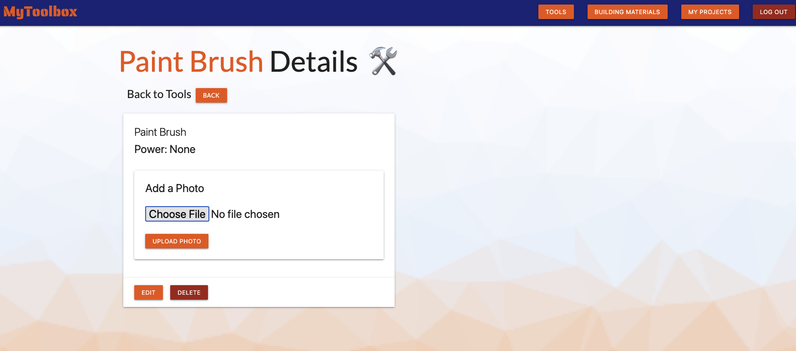

# MyToolbox - by Matt Packer

*MyToolbox* is a full stack Django application that makes full use of CRUD (Create, Read, Update, Delete) data operations.

This application is designed to allow users to track and plan their home renovation projects, and the tools and building materials used. In addition to creating projects, users can add their own tools and building materials to the application database, and upload pictures of the items which are stored using an AWS S3 cloud storage bucket and displayed in the app.

*MyToolbox* was created during the fourth unit of [General Assembly](https://www.generalassemb.ly)'s Software Engineering Immersive program. The initial version was planned, developed and deployed over the course of about one week. It was created using technologies including Python, Django, and PosegreSQL. 

Future enhancements are planned. See below for a list of ‘icebox’ features that I plan to implement in the future.

### Getting Started:
The app can be launched [here](https://mp-mytoolbox.herokuapp.com) and was deployed using Heroku.

I used [Trello](https://trello.com/b/G7p7wgEH/unit-4-mytoolbox#) to keep myself organized when planning and developing MyToolbox.

### Screenshots:

##### Landing Before Login

##### User Login Page

##### Landing After Login

##### My Projects

##### Add New Project

##### Project Details

##### Edit Project

##### Delete Project

##### Tool Details
###### with functionality to add a photo via AWS

### Technologies Used:
* [Python](https://www.python.org/)
* [Django](https://www.djangoproject.com/)
* [PostgreSQL](https://www.postgresql.org/) (Open Source Relational Database)
* HTML5
* CSS3
* [Materialize CSS](https://materializecss.com/)
* [Amazon AWS S3](https://aws.amazon.com/s3/faqs/) (Cloud Storage for User Photos)
* Git
* GitHub
* [Heroku](https://www.heroku.com/home) (Cloud Platform for App Deployment)

### Additional Tools and Resources:
* [Visual Studio Code](https://code.visualstudio.com/) (VS Code)
* [Trello](https://trello.com/en-US) (Project Planning and Organization Tool)
* [Whimsical](https://whimsical.com/) (Flowchart/Diagram/Wireframing Tool)
* [Canva](https://www.canva.com/) (Graphic Design Tool)
* [Trianglify.io](https://trianglify.io/) (Low-Poly Background Generator)
* [Slack](https://slack.com/) (Collaboration and Communication)

### Special Thanks:
* Thank you to my General Assembly SEI instructors (Ben Manley, Shahzad Khan, David Stinson) for the instruction, support, and help troubleshooting a few issues that occured during development!
* Thank you to all my peers in my cohort who assisted with additional troubleshooting and provided support during the development of this app.

### Next Steps (Icebox Features):
* Restyle app using another framework - like Bootstrap.
* Make the app responsive and mobile friendly.
* Add full budget tracking functionality for tools, materials, and other expenses.
* Enhance user interface for adding/removing materials and tools from projects by using a drop down menu to select/add new items.
* AAU, I should be able to adjust the quantity of each building material used in my project.
